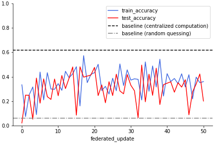

# Simulating Customer Journey Prediction in a Federated Learning Setup


```python
%load_ext lab_black
# nb_black if running in jupyter
```

[](https://zenodo.org/badge/latestdoi/415873102)

## About

In this study I show that customer paths can be predicted in a federated setup. 
The purpose of the work is to show, that this is possible using real customer journey data.
The purpose is not yet to provide optimal solutions.
The goal of the work was to observe machine learning in the given setup.
With these results I hope to encourage further research and innovation on federated learning for privacy preserving personalized digital services.

Federated learning (FL) is a term used for machine learning in de-centralized
setups where data is distibuted across edge devices [[1](#mcmahan2016communication)].
In a FL setup a shared model is learned by iteratively aggegating locally trained models.
A FL setup consists of a server updating a global model averaged from aggregate distributed model parameters,
and multiple clients (edge devices, for example mobile phones) that fit the global model to their data. 


FL can be used for improved privacy, because instead of data,
only the aggregated model parameters are shared. The raw data remains in the edge devices.
The federated service provider does not rerquire a direct access to the data.
However, the model update information still contains indirect information of the client data, so some privacy risks still prevail [[2](#truong2021privacy)].

Because each local dataset is hosted by an edge device and represents a single client, FL setups typically follow a few assumpions:
the data is strongly non-IID (it represents a single client),
unbalanced (the users use the service differently),
massively distributed (there are more clients than data points per client), 
and finally limited communication (federated updates require the device to be at rest, plugged to charger and connected to Wi-Fi).

A customer journey describes the service touchpoints and transitions between them as a customer goes through a service process.
We can model these as states of a stochastic process, and use machine learning to predict the next state based on the previous ones, and other information about the customer.
Knowing the most likely next states would allow a service provider to tailor the service for the individual customers. 

Typically, each customer may only have few data points of their own, e.g. few clicks on a web page since they have entered the service.
This means, that a localized machine learning model using the data of a single customer is not an option.
However, customers may be unwilling to share their data for centralized processing, as they are for example with website 'cookies' [[3](#mueller2018ignore)].

With federated learning, the customers could benefit from each other without directly sharing their data.
This makes customer journey prediction is an interesting field of application for federated learning,
especially in the public sector & government context.

For the public sector, this opens up new means for creating novel digital services. 
Cities or governments can provide the citizens personal AI assistants that give them personalized recommendation and advice in various areas of life,
including education, healthcare and career.
These kind of services would require very sensitive data, that the citizens may be unwilling to trust the government with, and that local regulation may prohibit the officials from collecting.
Federated learning can help provide these services, without the need for data share.

The results may also be applied to other next state prediction problems not involving human customers,
but artificial clients insted. One such example could be predicting faults on IoT devices.

## The simulation study

In this work I show how custom data can be used with TFF. I use the customer journey dataset by Bernard & Andritsos [[4](#bernard2019customer)].
I use 21k data points from 3000 customers (divided into 2100 train and 900 validation clients). There are 16 state labels (including an abstract state describing end of service), 2 customer background features (age and income) and the order of the action.
In the dataset, most customers only had 3-5 events recorded and the max observed was 10.
I create a simple federated learning setup for next state prediction on this dataset.
simulate the federated learning with TFF and compare the results against centralized computation baseline using identical NN model.

The code is presented in the wiki tabs CustomClientData and FederatedCustomerJourney and in the notebooks 00_data.ipynb and 01_model.ipynb that can be found from the root of the repository.

### Results


Train and validation accuracy in comparison to baselines. X-axis shows the federate update iterations, and y axis shows the accuracy. The federated updates are not directly comparable to progression of centralized computation, for which we only plot the result after 20 epochs.

We observe the federated learning achieves clearly better stats than random guessing, but does not perform as well as the centralized baseline.
Complete reproducibility proved difficult to achieve using TFF, so the results may vary depending on the run.

View the tabs / notebooks for further info.

It should be noted that the results were achieved in an optimistic scenario. For example the issues of changing client pool, client availablity, update scheduling and malicious behaviour were not considered in practice.


## Contents

The repository core structure is the following:

    data/   # A folder where data is loaded (empty, run 00_data.ipynb to load data)
    docs/   # HTML doc files are generated here
    ml_federated_customer_journey/ # python module, functions and classes from notebooks are exported here
    00_customclientdata.ipynb   # Load and clean data, define related functions
    01_federatedcustomerjourney.ipynb # federated simulation
    index.ipynb # this notebook, the repo README and wiki main page are generated from this
    settings.ini # project metadata for nbdev tool


## How to Install and Run

To install and run the code:

    git clone git@github.com:City-of-Helsinki/ml_federated_customer_path.git
    cd ml_federated_customer_path
    # (create and activate virtual environment of your choice)
    pip install requirements.txt
    nbdev_install_git_hooks

    # run 00_customclientdata.ipynb to load and clean data
    # run 01_federatedcustomerjourney.ipynb to run the federated learning simulation

    # to update ml_federated_customer_journey module and docs, call:
    nbdev_build_lib && nbdev_build_docs

Please note that the exact results are not reproducible due to inheritant reproducibility issues of TFF. 

Feel free to try out different setups!


## Contributing

Drop the authors message if you are interested in further research on the topic! (firstname.lastname(at)hel.fi)

See [here](https://github.com/City-of-Helsinki/ml_federated_customer_journey/blob/master/CONTRIBUTING.md) on how to contribute to the code.


## References

1) <a id='mcmahan2016communication'></a> McMahan et al. Communication-Efficient Learning of Deep Networks from Decentralized Data. 2021. Google Inc. https://arxiv.org/pdf/1602.05629.pdf

2) <a id='truong2021privacy'></a> Truong et al. Privacy Preservation in Federated Learning: An insightful survey from the GDPR Perspective. 2021. https://arxiv.org/abs/2011.05411

3) <a id='mueller2018ignore'></a> Mueller, R. 76% of Users Ignore Cookie Banners: the User Behaviour After 30 Days of GDPR. 2018. Amazee Metrics (online journal). https://www.amazeemetrics.com/en/blog/76-ignore-cookie-banners-the-user-behavior-after-30-days-of-gdpr/

4) <a id='bernard2019contextual'> Bernard, G., & Andritsos, P. (2019). Contextual and behavioral customer journey discovery using a genetic approach. In 23rd European Conference on Advances in Databases and Information Systems (ADBIS), pages 251–266, Cham. Springer.
Dataset available at: https://customer-journey.me/datasets/

This project was built using [nbdev](https://nbdev.fast.ai/) on top of the city of Helsinki [ml_project_template](https://github.com/City-of-Helsinki/ml_project_template).

## How to Cite

To cite this work, use:

```python
%%script False

@misc{
    sten2021simulating,
    title = {Simulating Customer Journey Prediction in a Federated Learning Setup},
    author = {Nuutti A Sten},
    month = {12},
    year = {2021},
    howpublished = {City of Helsinki},
    doi = {10.5281/zenodo.5801725},
}
```

    Couldn't find program: 'False'


## Copyright

Copyright 2021 City-of-Helsinki. Licensed under the Apache License, Version 2.0 (the "License");
you may not use this project's files except in compliance with the License.
A copy of the License is provided in the LICENSE file in this repository.

The Helsinki logo is a registered trademark owned by the city of Helsinki.
